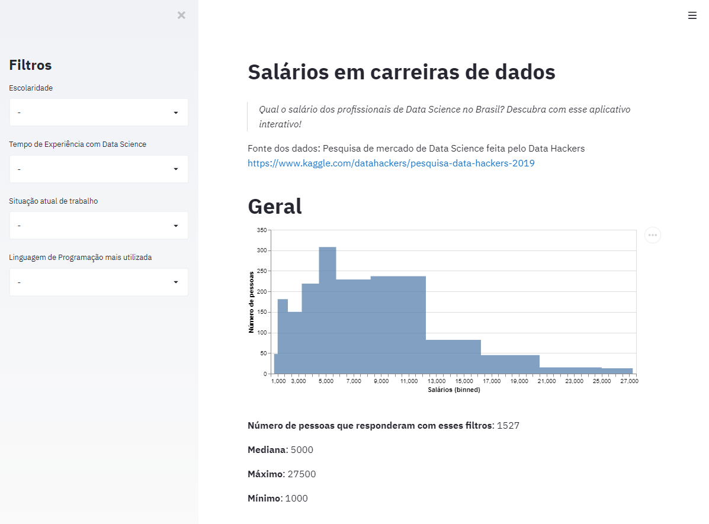

# Salários em carreiras de dados 
[](https://opensource.org/licenses/MIT)

> Qual o salário dos profissionais de Data Science no Brasil? Descubra com esse aplicativo interativo!

[https://salarios-data-science.herokuapp.com/](https://salarios-data-science.herokuapp.com/)



## Fonte dos dados: Pesquisa de mercado de Data Science feita pelo Data Hackers

[https://www.kaggle.com/datahackers/pesquisa-data-hackers-2019](https://www.kaggle.com/datahackers/pesquisa-data-hackers-2019)

## Instalação

```bash
pip install -r requirements.txt
```

## Como rodar

```bash
streamlit run src/data_science_salary.py
```
